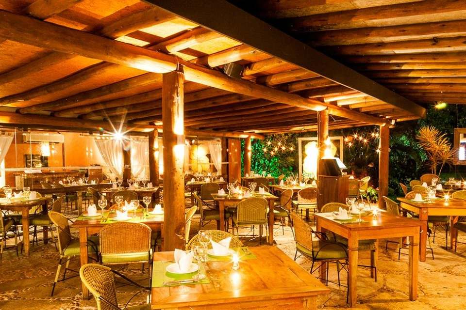

<h3 align="center">
  Desafio 3: Crie uma aplicação Back-end do zero.
</h3>

<blockquote align="center">
"Você nunca sabe o quão forte você é até ser forte é a única escolha que você tem."</blockquote>

  
  

  

  

## :computer:Sobre o desafio

## Objetivo:

Criar uma API que será consumida por uma aplicaçāo de pedidos de restaurantes, na qual o usuário fará a leitura de um QR que ficará na mesa do restaurante, mostrando assim todo o cardápio, além de realizar o pedido e o pagamento.

### Funcionalidades Geral (Dono do Restaurante e Cliente):
- Permita que um usuário se autentique em sua aplicação utilizando e-mail e senha;
- Para atualizar a senha, o usuário deve também enviar um campo de confirmação com a mesma senha;
- Criptografe a senha do usuário para segurança;
- Realize a validação dos dados de entrada;
- Crie uma rota para upload de arquivos que cadastra em uma tabela o caminho e nome do arquivo e retorna todos dados do arquivo cadastrado.

### Funcionalidades (Dono do Restaurante):
- Editar dados do Restaurante (nome empresa, telefone, email, endereço e logo);
- Cadastrar Pratos do Restaurante (nome do prato, categoria, valor do prato e imagem);
- Listar todas os pedidos dos clientes;
- Os pedidos terão os seguintes status = pendente, iniciado, cancelado e finalizado;
- Assim que o usuário confirmar ou cancelar um pedido, um aviso é enviado para o dashboard do restaurante.

### Funcionalidades (Cliente):
- Permita que novos usuários se cadastrem em sua aplicação utilizando nome, e-mail e senha;
- Editar o perfil;
- Listar o restaurante que foi escaneado pelo QR Code;
- Listar os 6 pratos mais pedidos;
- Listar todos os pratos;
- Mostrar detalhes de um determinado prato;
- Realizar um pedido;
- O cancelamento só poderá ser realizar, se o pedido não estiver com o status iniciado;

  

### Conhecimento em:

Qualquer linguagem back-end.

### Importante:

Código limpo e comentado sāo requisitos do desafio.

## :tada: Entrega

Copie a URL do repositório com o desafio e envie pela plataforma: https://platform.apollopartners.com.br/

## :question: Dúvidas

Acesse o <a href="https://github.com/Apollo-Group/Projeto-FAQ">
FAQ
</a> ou abra uma issue nesse repositório que retornamos em breve.

## :clipboard: Licença

Esse projeto está sob a licença MIT. Veja o arquivo [LICENSE](LICENSE) para mais detalhes.

---
